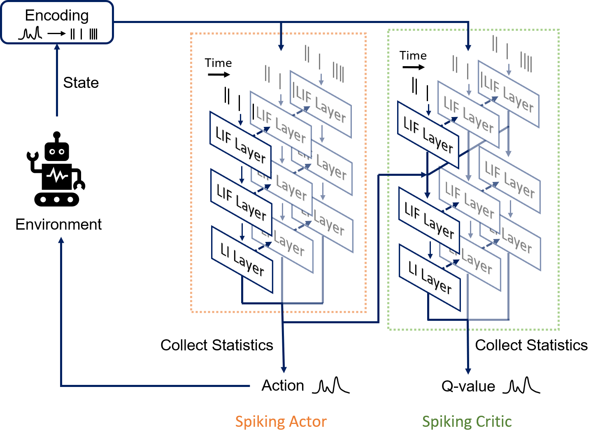

# Spiking Reinforcement Learning for Robust Robot Control Under Varying Operating Conditions

This is the repository for the Master of Science thesis: 

P. Mondorf: [Spiking Reinforcement Learning for Robust Robot Control Under Varying Operating Conditions](MSc_Thesis_PhilippMondorf.pdf), M.S. Thesis, School of Electrical Engineering and Computer Science, KTH Royal Institute of Technology, 2022. 

Over the last few years, deep reinforcement learning (RL) has gained increasing popularity for its successful application to a variety of complex control and decision-making tasks [[1]](#1). As the demand for deep RL algorithms deployed in challenging real-world environments grows, their robustness towards uncertainty, disturbances and perturbations of the environment becomes more and more important. However, most traditional deep reinforcement learning methods are not inherently robust [[2]](#2). Instead, many state-of-the-art deep RL algorithms have been observed to struggle with uncertainties and unforeseen changes in the environment [[3]](#3).

Spiking neural networks (SNNs) represent a new generation of neural networks that employ biological neuron models as computational units [[4]](#4). Inspired by information processing within the brain, SNNs communicate via sparse, event-driven sequences of electrical impulses, also denoted as spike trains [[5]](#5). When deployed on dedicated neuromorphic hardware, spiking neural networks exhibit desirable properties such as low latency and high energy-efficiency [[6]](#6). Furthermore, recent work indicates that SNNs are inherently robust towards noise and measurement errors [[7]](#7). This makes spiking neural networks promising candidates to be applied within the field of reinforcement learning. 

In this thesis, we introduce the *fully spiking deep deterministic policy gradient (FS-DDPG)* algorithm, a spiking actor-critic network for continuous control that
can successfully handle high-dimensional state and action spaces. We evaluate the FS-DDPG algorithm with respect to its robustness towards sensor noise and perturbations of the environment. To the best of our knowledge, this is the first work that studies the robustness properties of a spiking actor-critic network for continuous control.

We show that the FS-DDPG algorithm is more robust towards sensor noise and measurement errors than comparable non-spiking RL methods such as the DDPG algorithm. Our results align with previous works and indicate that spiking neural networks exhibit desirable robustness properties towards sensor noise and measurement errors. Aside from low latency and high power-efficiency on neuromorphic hardware, this might be a substantial advantage of SNNs, in particular within reinforcement learning.

<figure>
  
  <figcaption>Schematic overview of the fully spiking DDPG network. The FS-DDPG comprises a spiking actor network and a spiking critic network. The spiking actor network predicts an action at given a discrete spike representation of the state observation. Based on information about the action predicted and the encoded state observation, the spiking critic network estimates a respective action-value. The action is finally applied and the environment transits into a new state.</figcaption>
</figure>


If you find our work useful for your research, please cite it as: 

```
@mastersthesis{MondorfSpikingRL2022,
    author = {Philipp Mondorf},
    title = {Spiking Reinforcement Learning for Robust Robot Control Under Varying Operating Conditions}, 
    school = {KTH Royal Institute of Technology},
    year = {2022}, 
    type = {M.Sc. Thesis}
}
```

## References
<a id="1">[1]</a>  Yuxi Li: “Deep Reinforcement Learning: An Overview.” In: *CoRR* abs/1701.07274 (2017). URL: http://arxiv.org/abs/1701.07274. arXiv: 1701.07274

<a id="2">[2]</a>  Mooss et al.: “Robust Reinforcement Learning: A Review of Foundations and Recent Advances.” In: *Machine Learning and Knowledge Extraction* 4 (Mar. 2022), pp. 276–315. DOI: [10.3390/make4010013](https://www.mdpi.com/2504-4990/4/1/13).

<a id="3">[3]</a> Gabriel Dulac-Arnold, Daniel Mankowitz, and Todd Hester: "Challenges of Real-World Reinforcement Learning". 2019. arXiv: [1904.12901 [cs.LG]](https://arxiv.org/abs/1904.12901).

<a id="4">[4]</a> Wolfgang Maass: “Networks of spiking neurons: The third generation of neural network models.” In: *Neural Networks* 10.9 (1997), pp. 1659–1671. ISSN: 0893-6080. DOI: https://doi.org/10.1016/S0893-6080(97)00011-7.

<a id="5">[5]</a> Michael Pfeiffer and Thomas Pfeil. “Deep Learning With Spiking Neurons: Opportunities and Challenges.” In: *Frontiers in Neuroscience* 12 (2018). ISSN: 1662-453X. DOI: [10.3389/fnins.2018.00774](https://www.frontiersin.org/articles/10.3389/fnins.2018.00774/full).

<a id="6">[6]</a> Tavanaei et al.: “Deep learning in spiking neural networks.” In: *Neural Networks* 111 (2019), pp. 47–63. ISSN: 0893-6080. DOI: https://doi.org/10.1016/j.neunet.2018.12.002.

<a id="7">[7]</a> Patel et al.: “Improved robustness of reinforcement learning policies upon conversion to spiking neuronal network platforms applied to ATARI games.” In: *CoRR* abs/1903.11012 (2019). URL: http://arxiv.org/abs/1903.11012. arXiv: 1903.11012.